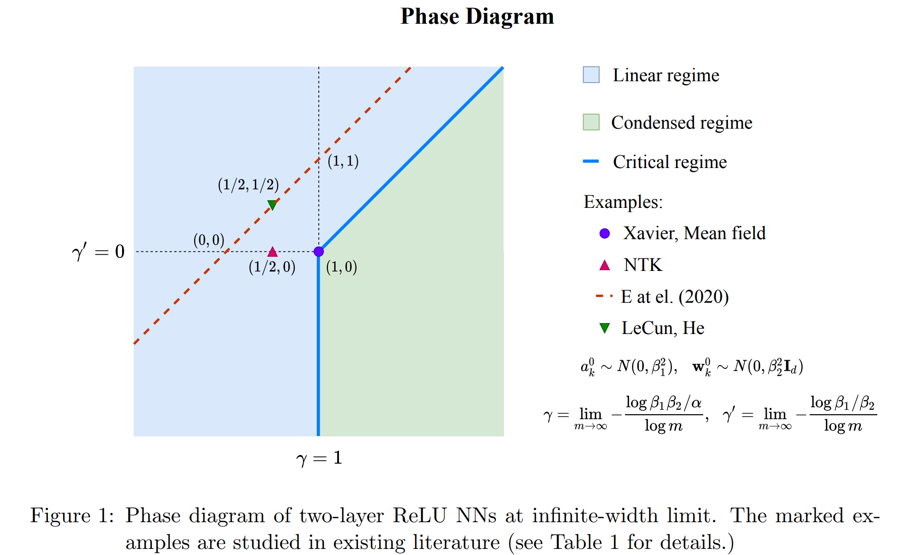

# Scripts

condense.ipynb: A complete code to verify condensation phenomenon for 1d functions.

initial_condense.ipynb: A simple code to verify initial condensation for high dimensional functions.

# Related Papers
[1] Tao Luo#, Zhi-Qin John Xu#, Zheng Ma, Yaoyu Zhang*, Phase diagram for two-layer ReLU neural networks at infinite-width limit. arxiv 2007.07497 (2020), Journal of Machine Learning Research (2021) [pdf](https://ins.sjtu.edu.cn/people/xuzhiqin/pub/phasediagram2020.pdf), and in [arxiv](https://arxiv.org/abs/2007.07497). 

[2] Hanxu Zhou, Qixuan Zhou, Tao Luo, Yaoyu Zhang*, Zhi-Qin John Xu*, Towards Understanding the Condensation of Neural Networks at Initial Training. arxiv 2105.11686 (2021) [pdf](https://ins.sjtu.edu.cn/people/xuzhiqin/pub/initial2105.11686.pdf), and in [arxiv](https://arxiv.org/abs/2105.11686), see slides and [video talk in Chinese](https://www.bilibili.com/video/BV1tb4y1d7CZ/?spm_id_from%253D333.999.0.0), NeurIPS2022. 

[3] Zhi-Qin John Xu*, Yaoyu Zhang, Zhangchen Zhou, An overview of condensation phenomenon in deep learning. arXiv:2504.09484 (2025), [pdf](https://ins.sjtu.edu.cn/people/xuzhiqin/pub/condensationoverview2025.pdf), and in [arxiv](https://arxiv.org/abs/2504.09484).

For more details, see [Zhi-Qin John Xu's homepage](https://ins.sjtu.edu.cn/people/xuzhiqin/pubcondense.html)

# Condensation Phenomenon

The condensation phenomenon in neural networks describes how, during the nonlinear training of neural networks, neurons in the same layer tend to condense into groups with similar outputs. 

The first figure illustrates the condensation phenomenon, where lines of the same color represent neurons possessing identical weights.

The second figure is the phase diagram for two-layer relu neural networks at infinite-width limit. The green region denotes the regime in which condensation occurs in the neural networks.

<!--  -->

### Core objective

To reproduce the condensation phenomenon in one dimension and high dimension.

## Contact information

Zhi-Qin John Xu (许志钦): xuzhiqin@sjtu.edu.cn

